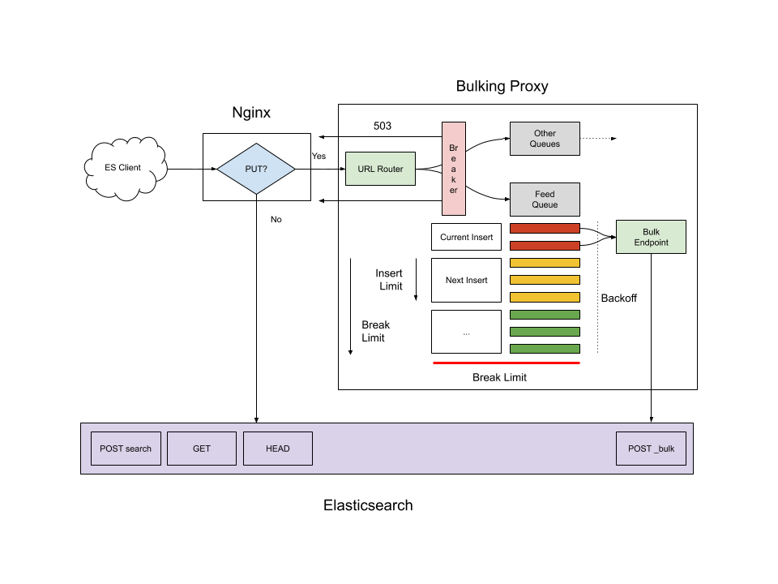

[](https://travis-ci.com/Zingle/esbulker)
[](https://coveralls.io/github/Zingle/esbulker?branch=travis-build)

esbulker Bulking Proxy for Elasticsearch
========================================

How the Proxy Works
-------------------
When a request is made to `PUT` a document, the proxy will queue the request
and immediately return a `202 Accepted` response.  As documents are queued,
the proxy will batch them up and `POST` them to a target Elasticsearch bulk
endpoint, such as `/<index>/<doctype>/_bulk`.

When a temporary problem is encountered writing to Elasticsearch, the proxy
will begin backing off to avoid overloading ES.  If a problem persists, the
proxy will start returning `503 Service Unavailable` errors and will no
longer queue any documents.



### Bulk Inserts
Bulk inserts are limited to 2 MiB of data.  This limit is checked *after* adding
a new document to the queue, so the actual amount of data will probably be a bit
more than this.

### Backoff
When the proxy can't connect to ES, or inserts become slow (>2s), or ES begins
to report errors, the endpoint will be backed off.  Backoff starts at 0.5s and
increases up to 60s between attempts.

While backed off, requests that have `?refresh=true` or `?refresh=wait_for` will
begin to take a long time.  Other requests will be accepted immediately and
queued.

### Circuit Breaker
When the queue grows too large (over 250 MiB), the proxy will begin to return
503 errors to the client.  This is too ensure the client doesn't continue to
load data while the proxy continues to fall further behind.

Installation
------------
```sh
sudo -H npm install -g @zingle/esbulker
```

Usage
-----
```
Usage:
  esbulker [-v|-q] [--es=<url>] [--ip=<addr>] [--port=<num>]
  esbulker --help
  esbulker --version

Start elasticsearch bulk load proxy.

OPTIONS

  --help                Show this help.
  --es=<url>            Elasticsearch server URL.
  --ip=<addr>           IP address proxy listens on.
  --port=<num>          Port proxy listens on.
  -q|--quiet            Show less output.
  -v|--verbose          Show more output.
  --version             Display version information.`

ENVIRONMENT

  ES_URL                Elasticsearch server URL.
  LISTEN_ADDR           IP address proxy listens on.
  LISTEN_PORT           Port proxy listens on.
```

Additional Setup
----------------
The `esbulker` proxy only accepts `PUT` requests to a specific document type
endpoint, that is `/<index>/<doctype>/<id>`.  Nginx or another proxy should
be used to split this acceptable traffic from the rest of the Elasticsearch
traffic.  The remaining traffic should be passed along to Elasticsearch.
